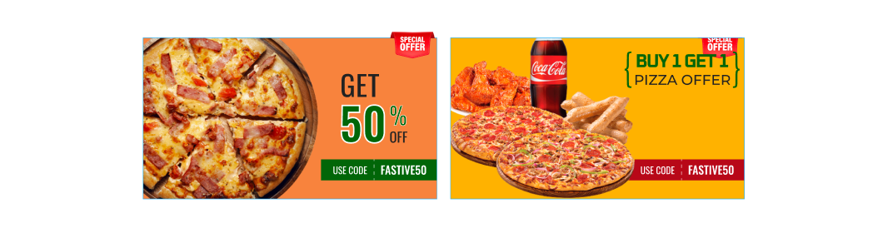
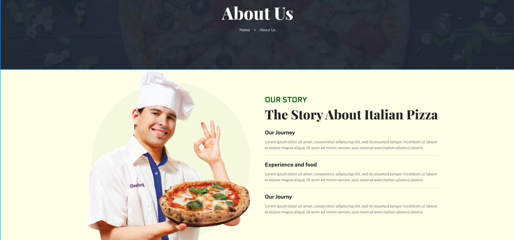
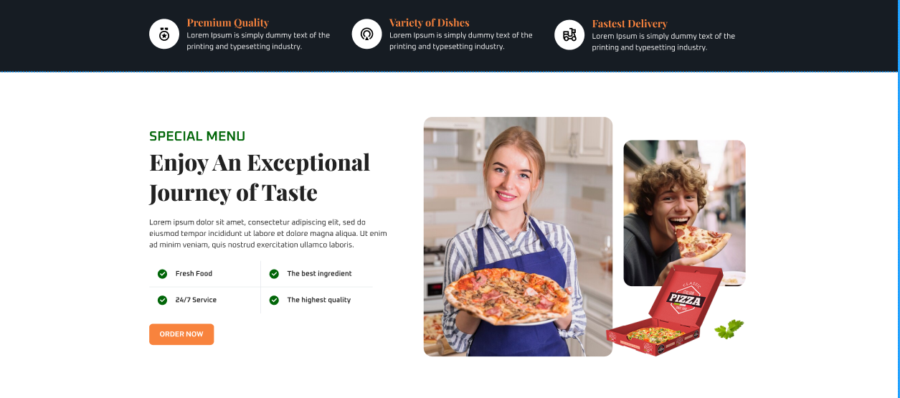
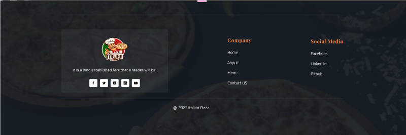

# Scarcity:

Scarcity is often created by emphasizing limited availability, time constraints, or exclusive opportunities. In the message provided, scarcity is highlighted through several techniques:

- **Limited Time Offer:** By stating that the "Buy One Get One Free Pizza" coupon is available for a "limited time only," you create a sense of urgency. Customers are more likely to take action when they believe they might miss out on a great deal.

- **Exclusive Opportunity:** Referring to the offer as an "exclusive" opportunity makes customers feel privileged and adds to the perceived value of the deal. People are more likely to act when they believe they're getting something special.

- **Reinforcement with Imagery:** The use of visual elements, like images of delicious pizzas or a ticking clock, can further emphasize the limited nature of the offer and enhance the overall impact of the scarcity message.

**Screenshot of coupon:**

 

# Social Proof:

Social proof is established by showcasing positive feedback and experiences from real customers. In the example testimonials, the following elements contribute to building social proof:

1. **Real Names:** Using real names of customers adds authenticity to the testimonials. It makes them more relatable and believable.

2. **Positive Language:** The testimonials use positive language to describe the experience, emphasizing words like "amazing," "unbeatable," "fantastic," and "delicious." Positive language reinforces the idea that your pizza and deals are of high quality.

3. **Recommendations:** When customers explicitly recommend your pizza and the promotional deal, it serves as a strong endorsement. People are more likely to trust recommendations from others who have had positive experiences.

4. **Personal Connection:** Statements like "count me in" and "pizza nights with friends" create a sense of personal connection, making the testimonials more relatable to potential customers.

**Screenshot of Social Proof:**

# Liking:

To convey a sense of positive liking or approval in the testimonials, I incorporated star ratings, which are a commonly recognized symbol for evaluating and expressing satisfaction. Here's how each element contributes to creating a perception of liking:

1. **Star Ratings:** The star ratings are a visual representation of customer satisfaction. Five stars are universally associated with excellence, and including them in the testimonials immediately communicates that these customers had an exceptionally positive experience.

2. **Positive Language:** The use of positive language in the testimonials, such as "amazing," "unbeatable," and "highly recommended," conveys a strong sense of liking. Positive words and expressions create an emotional connection and emphasize the enjoyment or satisfaction the customers derived from your products or services.

3. **Explicit Recommendations:** Customers explicitly recommending your pizza and the promotional deal further solidify the sense of liking. When someone suggests that others "trust me; you won't be disappointed," it adds a personal touch and strengthens the message of approval.

**Screenshot of Social Liking:**

# Commitment:

The commitment statement provided is crafted based on general best practices for creating brand commitments and promises. Here's how I approached each section:

1. **Introduction:** The introduction sets the tone by introducing the "Pizza Promise" and expressing a commitment to delivering an exceptional pizza experience.

2. **Quality Ingredients:** This section emphasizes the commitment to using high-quality, fresh ingredients in every pizza. Quality is a crucial aspect of many food brands, especially in the pizza industry.

3. **Customer Happiness Guarantee:** This section reassures customers that their satisfaction is a priority, and the brand is committed to resolving any issues to ensure a positive experience.

4. **Community Connection:** Demonstrating a commitment to community involvement and giving back contributes to a positive brand image and a sense of social responsibility.

5. **Closing:** The closing expresses gratitude for the customer's choice and reinforces the brand's commitment to excellence.

**Screenshot of Commitment:**

# Consistency:

The guidance on achieving consistency in a pizza branding website is derived from general principles of effective brand management and website design. Here's how I constructed the recommendations:

1. **Understanding Branding Principles:**
   - The advice incorporates fundamental principles of branding, including visual identity, messaging, and user experience.

2. **Consideration of Brand Elements:**
   - The recommendations address various brand elements, such as logos, color palettes, typography, and brand voice. Consistency in these elements contributes to a cohesive brand image.

3. **User-Centric Approach:**
   - Suggestions for navigation, mobile responsiveness, and loading times are based on a user-centric approach. A positive user experience is critical for customer satisfaction.

4. **Promotional and Content Strategy:**
   - Consistency in promotional messaging and content strategy is emphasized to maintain a unified brand message across different channels.

5. **Incorporation of Customer Service:**
   - Including customer service considerations recognizes the importance of consistent communication and responsiveness for building trust.

6. **Best Practices in Web Design:**
   - The recommendations align with general best practices in web design, considering factors like navigation, imagery, and content layout.

   **Screenshot of consistency:**

# Authority:

The guidance on establishing authority on a pizza branding website is based on general principles of effective brand management and online presence. Here's how I formulated the recommendations:

1. **Understanding Brand Authority:**
   - The advice is grounded in the concept of brand authority, which involves showcasing expertise, reliability, and trustworthiness in a specific industry—in this case, the pizza industry.

2. **Consideration of Brand Elements:**
   - The recommendations address various brand elements, such as culinary expertise, storytelling, testimonials, educational content, and partnerships. These elements collectively contribute to building authority.

3. **Customer-Centric Approach:**
   - Suggestions for customer testimonials, positive reviews, and celebrity endorsements are based on a customer-centric approach. Positive experiences shared by customers and influencers enhance the brand's credibility.

4. **Recognition of Industry Standards:**
   - The guidance recognizes the importance of industry standards, such as awards and certifications. Displaying such accolades helps build trust and positions the brand as a reputable player in the pizza industry.

5. **Educational Content and Transparency:**
   - Recommendations related to educational content and transparency stem from the idea that providing valuable information and being transparent about processes and ingredients can build credibility and trust with customers.

6. **Brand Consistency:**
   - The emphasis on consistent branding, both visually and in messaging, aligns with the principle that a cohesive and professional brand image contributes to perceived authority.

**Screenshot of Authority:**

